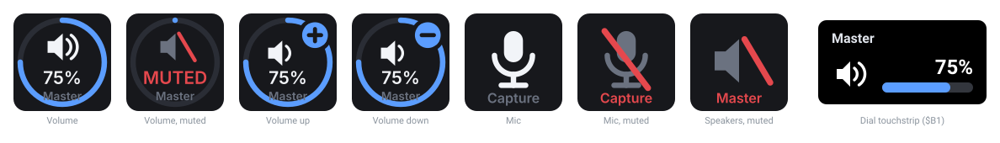

# OpenDeck ALSA plugin

[](LICENSE)
[](https://nodejs.org)
[](#requirements)

A native Linux plugin for [OpenDeck](https://github.com/nekename/OpenDeck) that drives ALSA
mixer controls directly.



- **Mute buttons** for the microphone, the speakers, or any other control.
- **Volume knobs** — dial rotation adjusts the level, pressing the dial mutes.
- **Any control, any card.** Each action picks its own sound card and control,
  from the same list `alsamixer` shows after pressing <kbd>F6</kbd>.
- **Live sync.** Change the volume in `alsamixer`, with a media key, or from
  anything else, and the keys update instantly — driven by `alsactl monitor`,
  not polling.
- **No dependencies.** Pure Node.js, no npm packages, no compiler, no ALSA
  development headers.

Keys draw their own artwork: a volume key shows a level ring and a percentage, a
mute key shows a speaker or microphone glyph that greys out and gains a red slash
when muted. Dials use the `$B1` layout with a title, value and indicator bar.

## Requirements

| | |
|---|---|
| Linux | with ALSA (any modern distribution) |
| Node.js | 18 or newer — 21+ uses the built-in `WebSocket`, older versions use the bundled client; no npm dependencies either way. On Node 18 or 19 the installer works around [OpenDeck's own `.js` version gate](#troubleshooting) |
| `amixer` | from `alsa-utils`; **required** |
| `alsactl` | from `alsa-utils`; optional, enables event-driven updates instead of 2 s polling |
| OpenDeck | 2.14 or newer |

Install `alsa-utils` if it is missing:

```sh
sudo apt install alsa-utils        # Debian, Ubuntu
sudo dnf install alsa-utils        # Fedora
sudo pacman -S alsa-utils          # Arch
```

Developed and tested against OpenDeck 2.14 on Linux with a Stream Deck + (keys
and dials). It should work on any OpenDeck-supported device; only the dial
touchstrip needs an encoder.

## Install

```sh
git clone https://github.com/constrictor/opendeck-alsa.git
cd opendeck-alsa
./install.sh
```

Then restart OpenDeck — it only scans for plugins at startup. The actions appear
under the **ALSA** category.

The installer checks your Node and `alsa-utils` versions, copies
`com.valentyn.alsa.sdPlugin/` into `~/.config/opendeck/plugins/`, and prints the
sound cards it can see. Any previous install is moved to
`~/.local/state/opendeck-alsa/backups/`.

<details>
<summary>Installing by hand</summary>

```sh
cp -r com.valentyn.alsa.sdPlugin ~/.config/opendeck/plugins/
chmod +x ~/.config/opendeck/plugins/com.valentyn.alsa.sdPlugin/plugin.js
```

The directory name must keep its `.sdPlugin` suffix. Do not leave backup copies
inside `plugins/` — OpenDeck loads *every* directory there, and a spare copy
registers as a duplicate plugin that fights the real one over the same actions.
</details>

### Updating

```sh
git pull && ./install.sh
```

Restart OpenDeck afterwards.

### Uninstalling

```sh
rm -rf ~/.config/opendeck/plugins/com.valentyn.alsa.sdPlugin
```

## Building

There is nothing to compile. The plugin is plain JavaScript run by the system
Node, and OpenDeck launches `plugin.js` directly.

The only generated artefacts are the static PNGs the manifest points at (the
action-list artwork and the pre-render fallbacks). Regenerate them after editing
`tools/gen-icons.js`:

```sh
npm run icons          # or: node tools/gen-icons.js
```

That script contains a small supersampled rasteriser and a PNG encoder written
against `node:zlib`, so it needs no image tooling installed.

The README's showcase image is generated too, straight from `lib/icons.js`, so
it cannot drift from what the plugin actually draws:

```sh
npm run showcase       # or: node tools/gen-showcase.js
```

Live key images are *not* built ahead of time — `lib/icons.js` renders them as
SVG at draw time so they can reflect the current level and mute state.

## Actions

### Volume

Adjusts the level of any control that has one.

| Setting | Meaning |
|---|---|
| Sound card | The default device, or a specific hardware card |
| Control | Any control with an adjustable level; `Auto` picks `Master` |
| Step | Percentage points per keypress or dial tick (default 5) |
| On press | *(keys)* toggle mute, volume up, volume down, or jump to a fixed level |
| On dial press | *(dials)* toggle mute, or do nothing |
| Label | Overrides the caption drawn on the key |
| Unmute on raise | Turning the volume up on a muted control unmutes it (on by default) |
| Volume scale | `Raw` is a plain percentage of the control's range; `Perceptual` uses `amixer -M`, matching how `alsamixer` maps dB onto its bar |

On a dial: rotate to adjust, push or tap to mute.

### Mute Toggle

Toggles a mute switch.

| Setting | Meaning |
|---|---|
| Target | `Microphone` (capture side, `alsamixer` <kbd>F4</kbd>), `Speakers` (playback, <kbd>F3</kbd>), or a custom control |
| Sound card | The default device, or a specific hardware card |
| Control | `Auto` resolves to `Capture` for the mic and `Master` for speakers |
| Show all controls | Also list controls that have no mute switch — those are muted by dropping the level to 0, and restored on unmute |

The icon follows the target: a microphone for capture controls, a speaker for
playback ones.

## Cards vs. the default device

The card dropdown lists the ALSA **default** device first, then each hardware
card — the same order `alsamixer`'s <kbd>F6</kbd> dialog uses.

On most desktops the default device is PipeWire or PulseAudio (the plugin reads
its real name and labels it, e.g. `Default (PipeWire)`). Its `Master` and
`Capture` are the *system-wide* volume — the one media keys and the desktop
volume applet move. That is usually what you want for a master volume knob or a
mic-mute button.

Pick a hardware card instead when you want to reach a specific piece of
hardware: a second interface, an HDMI output, a mic boost, or a control the
sound server does not expose at all.

Both work identically, including live sync — `alsactl monitor` watches the
default device as happily as it watches `hw:N`.

## How it works

```
OpenDeck ──WebSocket(Stream Deck protocol)──> plugin.js
                                                 │
                                    ┌────────────┴─────────────┐
                                    │                          │
                          amixer scontents           alsactl monitor <device>
                        (read + write state)       (change events, no polling)
```

A *target* is either `-D default` (the sound server) or `-c N` (a hardware
card); everything below works the same for both.

- `lib/alsa.js` parses `amixer <target> scontents`, which dumps every simple
  control in one call, into structured state (level, mute, capabilities, enum
  items). All subprocesses run with `LC_ALL=C` so parsing is locale-independent.
- `lib/monitor.js` runs one `alsactl monitor` per target in use,
  reference-counted so the subprocess starts when the first action on that
  target appears and is killed when the last one goes away. It restarts itself
  if the card disappears, so re-plugging a USB interface recovers on its own.
- `lib/icons.js` renders key images as SVG data URIs at draw time, so they can
  show live state without a pre-rendered sprite for every combination.

### Behaviours worth knowing

- **Mute is set, not toggled.** `amixer sset … toggle` flips each channel
  independently, so channels that have drifted out of sync never fully mute.
  The plugin reads the current state and writes the explicit opposite.
- **Capture switches use the right verb.** Capture-only controls need
  `cap`/`nocap` rather than `on`/`off`.
- **Rotation is coalesced.** Spinning a dial fast accumulates the pending delta
  and issues one `amixer` call at a time instead of dozens of concurrent ones.
- **Controls are cached for 400 ms**, so a burst of change events costs one read.
- **An unknown card falls back to the default device**, never to card 0 — if a
  card index shifts after a reboot, a mute button lands on the system mixer
  rather than silently driving whichever card happens to be first.

### Two rendering rules that are easy to get wrong

Keys and dials are drawn by completely different code, and both constrain the
images a plugin produces. These cost real debugging time, so they are worth
writing down.

**Data URIs must be base64.** Keys are drawn by OpenDeck's webview, which
accepts a URL-encoded `data:image/svg+xml;charset=utf8,…` happily. The dial
touchstrip is rendered natively by
[`streamdeck-strip-render`](https://github.com/FrostyCoolSlug/streamdeck-strip-render),
whose data-URL parser bails out unless the header contains `base64`, leaving an
empty pixmap that shows up as a checkerboard. Everything here emits
`data:image/svg+xml;base64,…`, which both paths accept.

**A dial's state image *is* its icon slot.** OpenDeck feeds the image set with
`setImage` into the layout's `icon` item as an override. In `$B1` that slot is
48×48, beside a title, a value and an indicator bar — so a dial gets a plain
glyph, and only a key gets the level ring, percentage and caption. Sending the
key artwork to a dial produces an unreadable thumbnail duplicating the numbers
already next to it.

## Development

```sh
node tools/test-plugin.js [cardIndex]   # end-to-end test against real hardware
node tools/test-ws.js                   # WebSocket client unit test (no hardware)
node tools/gen-icons.js                 # regenerate the static PNGs
node tools/gen-showcase.js              # regenerate docs/showcase.svg
```

`tools/test-plugin.js` is an end-to-end test, not a unit test: it spawns the
real plugin against a mock OpenDeck, drives it through registration, key
presses, dial rotation, property-inspector queries and external `amixer`
changes, asserts on what the plugin sends back, and restores every mixer value
it touched. It needs a real sound card and passes on the ALSA default device
too. Set `OPENDECK_ALSA_WS=fallback` to run it against the bundled WebSocket
client instead of the runtime's built-in one, which is how the Node 18 path is
covered on a newer Node.

`tools/mock-opendeck.js` is a minimal WebSocket *server* — Node ships a client
but no server, and the project has no npm dependencies, so the few dozen lines
of RFC 6455 framing live there. `lib/ws.js` is the mirror image: a client for
Node 18 and 20, which have no global `WebSocket`.

### Layout

```
com.valentyn.alsa.sdPlugin/
├── manifest.json
├── plugin.js                 # entry point; protocol + action logic
├── plugin.sh                 # launch wrapper for OpenDeck on Node 18/19
├── lib/
│   ├── alsa.js               # amixer read/write and parsing
│   ├── monitor.js            # alsactl monitor subprocess manager
│   ├── icons.js              # runtime SVG key images
│   └── ws.js                 # global WebSocket, or a bundled client on Node <21
├── icons/                    # static PNGs referenced by the manifest
└── propertyInspector/
    ├── alsa-pi.js            # shared settings + live card/control lists
    ├── styles.css
    ├── volume.html
    └── mute.html
tools/
├── gen-icons.js              # PNG rasteriser and encoder (build-time)
├── gen-showcase.js           # builds docs/showcase.svg from lib/icons.js
├── mock-opendeck.js          # minimal WebSocket server for testing
├── test-plugin.js            # end-to-end test
└── test-ws.js                # WebSocket client unit test
```

### Contributing

Issues and pull requests are welcome. Please make sure
`node tools/test-plugin.js` passes before opening a PR, and add a check for any
behaviour you fix — the suite is cheap to extend and every past bug has one.

Tabs for indentation, matching the existing files.

## Troubleshooting

**The actions do not appear.** Restart OpenDeck; it only scans for plugins at
startup. Check `~/.local/share/opendeck/logs/opendeck.log` for a
`Registered plugin com.valentyn.alsa.sdPlugin` line.

**The log says `Node.js version 20.0.0 or higher is required`.** That is
OpenDeck, not this plugin: it refuses to launch any plugin whose `CodePath`
ends in `.js` unless `node --version` is at least `v20.0.0`, and no manifest
field overrides it. The plugin runs fine on Node 18, so `install.sh` points the
installed manifest at `plugin.sh` — a wrapper that OpenDeck runs as a plain
executable — whenever it finds an older Node. Re-run `./install.sh` and restart
OpenDeck. Upgrading Node past 20 also works and needs no wrapper.

**A key shows a red crossed circle.** The configured control is not present on
the selected card. Reopen the action's settings and pick it again; the dropdown
keeps a missing selection visible rather than silently retargeting it.

**A hardware card has no usable controls.** HDMI-only cards typically expose
just `IEC958` switches and no volume at all, so the volume dropdown will be
empty. Use the default device for system volume, or pick the card with your
analogue codec.

**Nothing happens when pressing a key.** Check the plugin's own log at
`~/.local/share/opendeck/logs/plugins/com.valentyn.alsa.sdPlugin.log`.

**Volume jumps in large steps.** Some controls have very few steps — a mic boost
often has four. Lower the step size, or switch to the perceptual scale.

**Updates are sluggish.** If `alsactl` is missing the plugin falls back to
polling every 2 s; the log says so on startup. Install `alsa-utils`.

## License

Copyright (C) 2026 Valentyn Pavliuchenko

This program is free software: you can redistribute it and/or modify it under
the terms of the GNU General Public License as published by the Free Software
Foundation, either version 3 of the License, or (at your option) any later
version.

This program is distributed in the hope that it will be useful, but WITHOUT ANY
WARRANTY; without even the implied warranty of MERCHANTABILITY or FITNESS FOR A
PARTICULAR PURPOSE. See the [GNU General Public License](LICENSE) for more
details.

### Third-party material

None. Every file here is original to this project.

The property inspector deliberately does **not** use the Stream Deck SDK's
`sdpi.css`: its licensing is unclear and it could not be redistributed under the
GPL, so `propertyInspector/styles.css` was written from scratch. It keeps the
conventional label-left / control-right row layout so the panels still feel at
home next to other plugins.

## Acknowledgements

- [OpenDeck](https://github.com/nekename/OpenDeck) by Aman Khanna (nekename),
  which makes Stream Deck hardware genuinely pleasant to use on Linux.
- [`streamdeck-strip-render`](https://github.com/FrostyCoolSlug/streamdeck-strip-render)
  by FrostyCoolSlug, which renders the dial touchstrip.
